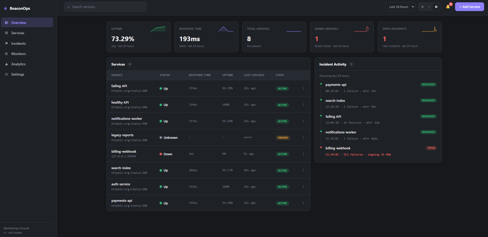
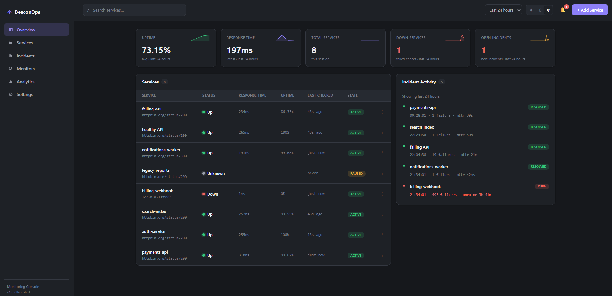
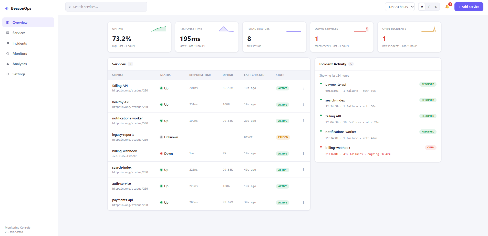
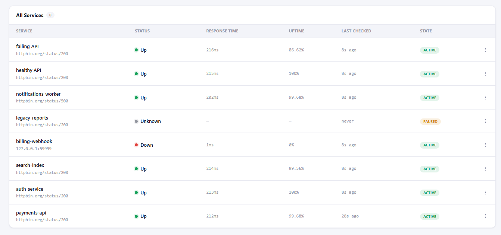
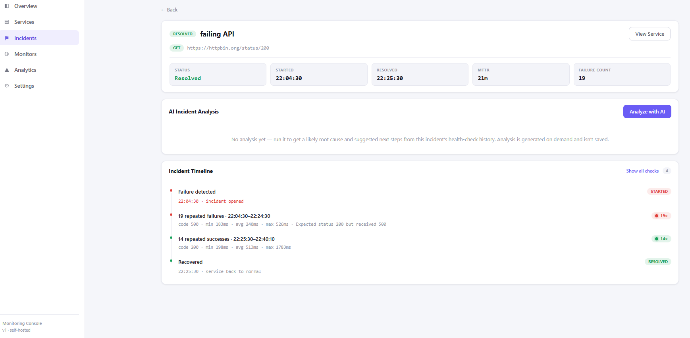
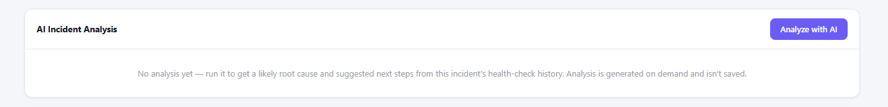

# BeaconOps

A self-hosted API uptime monitor that turns failures into incidents automatically, and can explain what went wrong when you ask it to.

## Why I built this

Most small monitoring projects stop at pinging a URL and showing a green or red dot. What actually makes an incident tool useful is what happens after something breaks: how fast you notice, how much history you have to diagnose it, and whether you can figure out the likely cause without digging through raw logs by hand.

BeaconOps is my attempt at that fuller loop. You register a service with a URL and an expected status code, and a background scheduler checks it on its own schedule. The moment a check fails, an incident opens automatically. There's no manual "report an outage" step. Every incident carries its health-check history with it, and you can ask an AI model to read that history and give you a plain-English root cause and a first set of things to check.

It's built to run and read like a real small service rather than a demo script. There's input validation at the API boundary, a background worker that survives one bad target failing, production-safe CORS and env-var handling, and a data model that was designed on paper before any code was written. See `docs/architecture.md` for that.



## Key Features

- **Automatic health checks.** A `node-cron` scheduler ticks every 10 seconds and checks whichever services are due, based on each service's own configurable interval.
- **Automatic incident lifecycle.** The first failed check opens an incident, later failures increment its failure count, and the first successful check after that resolves it automatically.
- **Manual on-demand check.** A "check now" action runs a real probe immediately through the same code path the scheduler uses.
- **Per-service and fleet-wide dashboards.** KPI cards, uptime sparklines, and a bucketed time series over 1h, 6h, 24h, and 7d windows.
- **Incident timeline.** A chronological view of an incident that merges its start and resolve markers with the surrounding health checks. Long runs of identical checks collapse into a single summary row, so a long outage doesn't render as hundreds of nearly identical lines.
- **AI-powered incident analysis.** On request, sends an incident's own data (service config, timing, and its health-check window) to OpenAI and gets back a structured root cause, evidence, and suggested next steps.
- **Light, dark, and system theme**, persisted per browser, with no flash of the wrong theme on load.
- **Pause, resume, edit, and delete** for monitored services, with confirmation dialogs and toast feedback for destructive actions.
- **Production-safe by default.** Origin-restricted CORS, a database-backed health endpoint, and startup and build-time checks that fail loudly instead of misbehaving quietly when configuration is missing.

## Screenshots

| | |
|---|---|
| **Dashboard, dark mode** |  |
| **Dashboard, light mode** |  |
| **Service detail** |  |
| **Incident detail and timeline** |  |
| **AI incident analysis** |  |

## End-to-end demo workflow

This is the actual loop the system runs, start to finish:

1. **Register a service.** Give it a name, a URL, an expected status code, a check interval, and a timeout.
2. **Healthy.** The scheduler checks it on schedule, each result is stored in `health_checks`, and the service's dashboard status stays "up".
3. **Failure.** The monitored endpoint starts returning the wrong status, times out, or refuses the connection. The very next check is classified "down" and an incident opens immediately. V1 uses a 1-failure threshold by design, more on that under design decisions below.
4. **Ongoing outage.** Every further failed check increments the incident's failure count and adds to its health-check history. The dashboard's open-incident count and the service's status both update live through polling.
5. **Recovery.** The first check that matches the expected status again resolves the incident automatically, setting `resolved_at`. There's no manual close step.
6. **AI analysis, optional and on demand.** From the incident's detail page, clicking "Analyze with AI" sends that incident's own timing and health-check window to OpenAI and renders back a root cause, supporting evidence, and suggested next steps. Nothing is saved to the database, so reopening the incident later shows a blank panel again until you run it.

## Architecture overview

```
┌─────────────┐      REST/JSON      ┌──────────────┐        ┌──────────────┐
│ React+Vite  │ ──────────────────► │ Node/Express │ ──────►│ PostgreSQL   │
│  Frontend   │ ◄────────────────── │   API Server │ ◄──────│              │
└─────────────┘                     └──────┬───────┘        └──────┬───────┘
                                            │                        ▲
                                            │ triggers/reads         │
                                            ▼                        │
                                    ┌──────────────┐                 │
                                    │ node-cron    │ ────────────────┘
                                    │ scheduler,   │  writes checks/incidents
                                    │ same process │
                                    └──────┬───────┘
                                            │ HTTP requests
                                            ▼
                                    ┌──────────────┐
                                    │ Monitored    │
                                    │ APIs/Services│
                                    └──────────────┘
                                            
                          POST /api/incidents/:id/analyze
                                            │
                                            ▼
                                    ┌──────────────┐
                                    │ OpenAI API   │  incident context only,
                                    │ (Responses)  │  result not persisted
                                    └──────────────┘
```

The scheduler runs in the same Node process as the API server, not as a separate worker or queue. See design decisions below for why. The frontend never talks to Postgres or OpenAI directly. Everything goes through the Express REST API.

## Tech Stack

**Backend**
- Node.js + Express (REST API)
- PostgreSQL, accessed through raw `pg` queries behind a repository layer, no ORM
- `node-cron` for the in-process background scheduler
- OpenAI's Responses API through native `fetch`, no SDK dependency

**Frontend**
- React 19 + Vite 8
- No routing library. It's a single dashboard page with state-based view switching between the list, service detail, and incident detail.
- Plain CSS with theme tokens for light, dark, and system mode, no CSS framework
- `oxlint` for linting

**Infrastructure**
- Docker Compose runs the local PostgreSQL instance. The backend and frontend run natively with `npm run dev` or `npm start`. There's no Dockerfile for the app itself yet.

## Design decisions

A few choices here were made on purpose, and most of them are recorded in `docs/architecture.md`, written before any code was.

- **In-process scheduler, not a queue.** `node-cron` runs inside the same process as the API server instead of Redis or BullMQ. It's isolated in `worker/scheduler.js`, so it could be swapped for a real queue later without touching the check-running or incident logic.
- **One failed check opens an incident, not several in a row.** This favors noticing problems immediately over filtering out noise from a single flaky failure. A configurable threshold is on the roadmap.
- **AI analysis is generated on demand and never persisted to Postgres.** An earlier version wrote the AI's output into the `incidents` table. I rolled that back in favor of calling the model fresh each time and returning the result directly in the API response. The database columns are still there for a possible future version, just unused by the current write path.
- **Raw SQL over an ORM.** A repository layer wraps `pg` queries per module. For a schema this small, an ORM would have added a dependency and an abstraction layer without much payoff.
- **Polling instead of WebSockets.** The frontend polls REST endpoints every 15 seconds. Simpler to reason about and debug than a live-push layer, at the cost of near-real-time updates instead of instant ones.
- **CORS fails closed.** In production, only origins listed in `FRONTEND_ORIGIN` are allowed, plus the local Vite dev origin. There's no wildcard fallback, so a misconfigured deployment blocks requests instead of accepting them from anywhere.
- **Frontend production builds fail fast.** `vite build` refuses to produce a bundle if `VITE_API_BASE_URL` isn't set. Vite only bundles code at build time, it doesn't execute it, so a runtime-only check would never surface until someone loaded a broken page in a browser.

## Project structure

```
api-monitoring-incident-platform/
├── backend/
│   ├── src/
│   │   ├── config/          # db pool (with optional TLS for hosted Postgres)
│   │   ├── db/
│   │   │   ├── migrations/  # numbered, idempotent SQL migrations
│   │   │   └── migrate.js   # migration runner
│   │   ├── modules/
│   │   │   ├── services/    # CRUD + validation + repository
│   │   │   ├── healthChecks/# repository only, no public write endpoint
│   │   │   ├── incidents/   # list/detail + AI analysis endpoint
│   │   │   └── dashboard/   # summary + time-bucketed metrics
│   │   ├── worker/
│   │   │   ├── scheduler.js       # node-cron tick loop
│   │   │   ├── checkRunner.js     # performs the HTTP probe
│   │   │   ├── recordHealthCheck.js
│   │   │   └── incidentEngine.js  # opens/increments/resolves incidents
│   │   ├── middleware/       # error handling, async wrapper
│   │   ├── app.js            # express app assembly (CORS, routes, health)
│   │   └── server.js         # entrypoint, validates env, starts app + scheduler
│   └── .env.example
├── frontend/
│   ├── src/
│   │   ├── api/              # fetch wrapper + per-module API clients
│   │   ├── components/       # ServicesTable, IncidentTimeline, MetricCards, etc.
│   │   ├── pages/            # DashboardPage, ServiceDetailPage, IncidentDetailPage
│   │   ├── hooks/            # polling, theme, toast, metric history
│   │   └── App.jsx
│   ├── vite.config.js        # includes the production env-var build guard
│   └── .env.example
├── docs/
│   └── architecture.md       # the approved design doc, written before implementation
├── docker-compose.yml        # PostgreSQL only
└── .env.example               # docker-compose Postgres credentials
```

## Local development setup

**Prerequisites:** Node.js 18 or newer, since the OpenAI integration uses native `fetch`. Docker, for Postgres. An OpenAI API key if you want the AI analysis feature. Developed and tested on Node 24.

```bash
# 1. Start Postgres
cp .env.example .env
docker compose up -d

# 2. Backend
cd backend
cp .env.example .env      # edit DATABASE_URL / AI_* if needed
npm install
npm run migrate           # safe to re-run, skips already-applied migrations
npm run dev                # http://localhost:4000

# 3. Frontend (new terminal)
cd frontend
cp .env.example .env
npm install
npm run dev                # http://localhost:5173
```

Open `http://localhost:5173`, add a service (any `http://` or `https://` URL works, including one that doesn't exist yet, to see a failure), and watch it move through the lifecycle described above.

## Environment variables

Secrets and per-environment config all come from `.env` files, never from source. No `.env` file is committed anywhere in this repo, only `.env.example` files with placeholder values. `AI_API_KEY` stays on the backend: it's never sent to the frontend and never appears in a response or log line.

**Root `.env`** (used only by `docker-compose.yml`):

| Variable | Required | Notes |
|---|---|---|
| `POSTGRES_USER` | No | Defaults to `postgres` |
| `POSTGRES_PASSWORD` | No | Defaults to `postgres` |
| `POSTGRES_DB` | No | Defaults to `api_monitoring` |

**`backend/.env`:**

| Variable | Required | Notes |
|---|---|---|
| `PORT` | No | Defaults to `4000` |
| `DATABASE_URL` | **Yes** | Server and migrations refuse to start without it |
| `DATABASE_SSL` | No | Set `true` for hosted Postgres providers that require TLS |
| `FRONTEND_ORIGIN` | Only for production | Exact deployed frontend origin, for CORS. Not needed for local dev |
| `AI_PROVIDER` | Only for AI analysis | Must be `openai`. Any other value fails loudly rather than silently doing nothing |
| `AI_MODEL` | Only for AI analysis | e.g. `gpt-5-mini` |
| `AI_API_KEY` | Only for AI analysis | Feature is disabled gracefully, a clear error rather than a crash, if unset |

**`frontend/.env`:**

| Variable | Required | Notes |
|---|---|---|
| `VITE_API_BASE_URL` | Only for production builds | Falls back to `http://localhost:4000` in dev. A production build fails immediately without it |

## Main API endpoints

```
Services
  POST   /api/services              create a monitored service
  GET    /api/services              list services (?range=1h|6h|24h|7d)
  GET    /api/services/:id          service detail + metrics series + recent checks/incidents
  PATCH  /api/services/:id          update name/url/interval/timeout/active
  DELETE /api/services/:id          remove a service (cascades its checks/incidents)
  POST   /api/services/:id/check    run one on-demand check now

Incidents
  GET    /api/incidents             list incidents (?status=open|resolved)
  GET    /api/incidents/:id         incident detail + surrounding health checks
  POST   /api/incidents/:id/analyze generate an AI root-cause analysis (not persisted)

Dashboard
  GET    /api/dashboard/summary     current counts: services up/down, open/resolved incidents, 24h uptime
  GET    /api/dashboard/metrics     bucketed time series (?range=1h|6h|24h|7d)

Health
  GET    /api/health                200 if the DB is reachable, 503 if not
```

There's no endpoint to create a health check directly. Only the background worker writes to that table.

## Testing

There's no automated test suite yet, no Jest or Vitest configured. Everything below was tested by hand against a real local Postgres instance, and for the AI feature, real OpenAI API calls:

- Full incident lifecycle: healthy, failing, incident opens on the first failure, failure count increments, recovers, incident resolves on its own.
- Manual on-demand check, independent of the scheduler's own timing.
- Input validation: rejected non-`http(s)` URLs, out-of-range intervals and timeouts, and a timeout that doesn't fit inside its check interval.
- Worker resilience: one failing or unreachable service doesn't stop other services' checks or crash the scheduler.
- AI analysis: ran a real incident with genuine `ECONNREFUSED` health checks through the actual OpenAI call. Output matched the expected structure, and repeated calls never wrote anything to the database.
- AI error handling: missing config, wrong `AI_PROVIDER`, malformed or incomplete model output, refusals, auth failures, and rate limits each map to a distinct, clear error instead of a generic 500.
- CORS: local dev origin, a configured production origin, and an unrecognized origin, which gets rejected with a 403.
- Health endpoint: 200 with the database reachable, 503 when it isn't, without crashing the process.
- Migrations: re-running them skips already-applied files, so they're safe to run again.
- Production frontend build: fails clearly without `VITE_API_BASE_URL`, and bakes in the real URL correctly when it's set. No `localhost` reference makes it into the built bundle.

## AI incident analysis

When you click "Analyze with AI" on an incident:

1. The backend loads that incident's own record and the health checks in its failure window. Nothing from other services, other incidents, or the `.env` file goes into the request.
2. It calls OpenAI's Responses API using native `fetch`, no SDK involved, with a strict JSON schema requiring five fields: `summary`, `likelyCause`, `suggestedSteps`, `evidence`, and `confidence` (`low`, `medium`, or `high`).
3. The response is validated against that same shape again in code, independent of the schema enforcement, before it's trusted.
4. The result comes back directly in the API response. It is not written to Postgres. Closing and reopening the incident, or just asking again, always calls the model fresh.

Keeping AI output out of the database was intentional for V1. It avoids stale or misleading analysis sitting next to real monitoring data, and it keeps the feature obviously opt-in: every click is one real API call, not a cached result.

## Roadmap

- Containerize the backend and frontend. Docker Compose already covers Postgres.
- Deploy a live instance. Production-readiness work like CORS rules, environment validation, and hosted-Postgres support is already done.
- Add automated tests. Everything so far has been tested by hand.
- Notifications on incident open: email, Slack, or a webhook.
- A configurable consecutive-failure threshold before opening an incident.
- Basic SSRF protection for monitored URLs.
- Authentication and multi-user support.
- A retention policy for `health_checks`.
- Richer uptime and SLA reporting beyond simple averages.

## What I learned building BeaconOps

A few things stuck with me more than I expected going in.

**Keeping the scheduler isolated paid off.** `node-cron` wiring lives in its own small file, separate from the actual check and incident logic. That meant I could reason about a slow check or two overlapping ticks without touching anything else. It's also the first piece I'd replace if this ever needed to grow.

**Reversing a decision after shipping it is normal, and cheaper if you planned for it.** I originally persisted the AI analysis to Postgres, then rolled that back to a request-time-only result once it was clear that wasn't the right call for V1. Because the write path lived behind one repository function, removing it was a small change, not a rewrite.

**`vite build` doesn't run your code, it bundles it.** I first tried to fail a misconfigured production build by throwing inside application code. That did nothing at build time and would only have shown up as a broken page in someone's browser later. The real fix had to live in `vite.config.js`, which actually runs during the build.

**CORS is a decision, not a checkbox.** `cors()` with no arguments works, in the sense that requests succeed, but it isn't a decision, it's the absence of one. Writing an explicit allowlist forced me to think about what production actually needs versus what local development needs, instead of hoping they'd never diverge.

**Writing the design down before coding paid for itself.** `docs/architecture.md` existed before any application code did. Going back to it for endpoint shapes, the incident threshold, and what to defer kept later decisions consistent instead of ad hoc.
